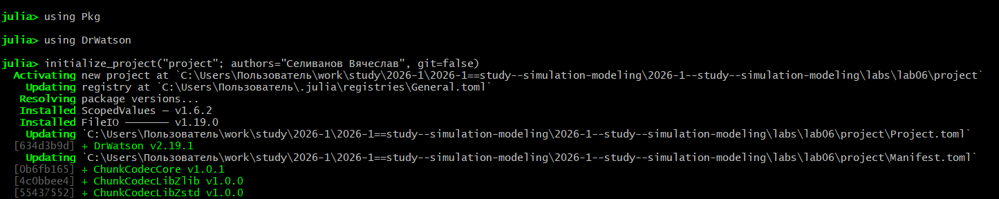
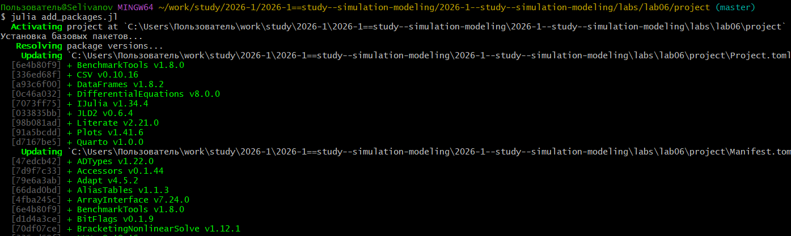
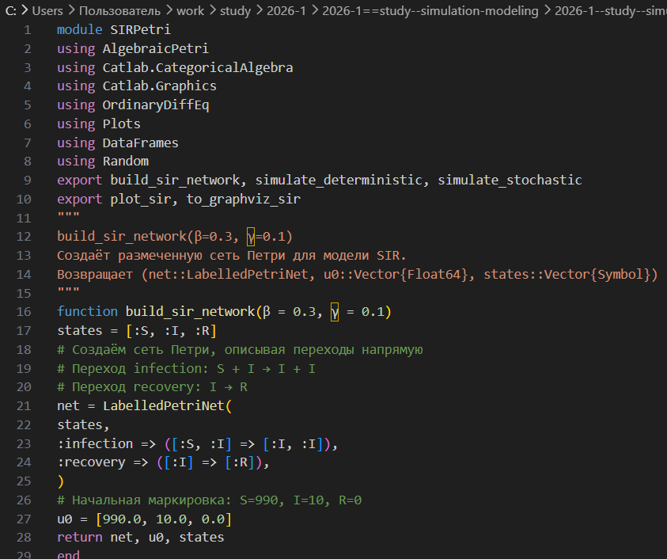
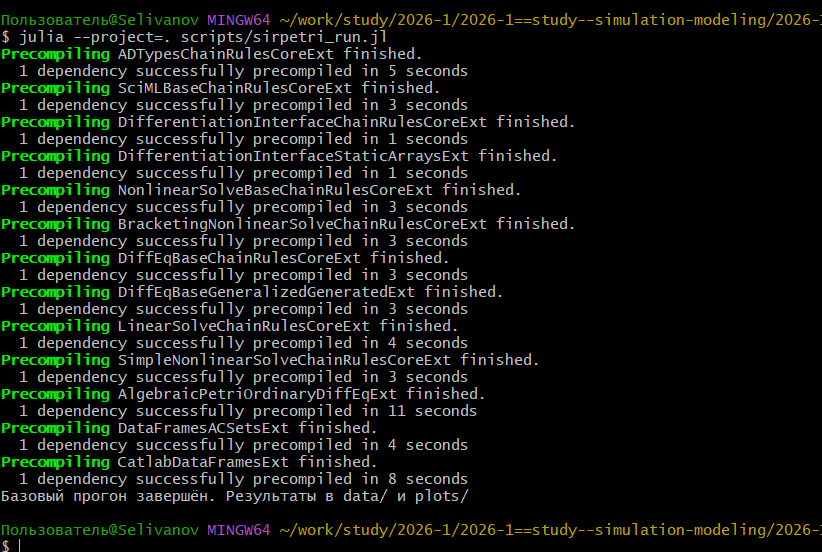
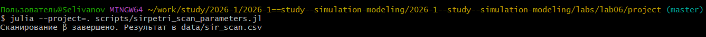
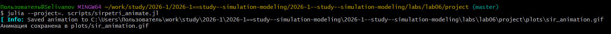
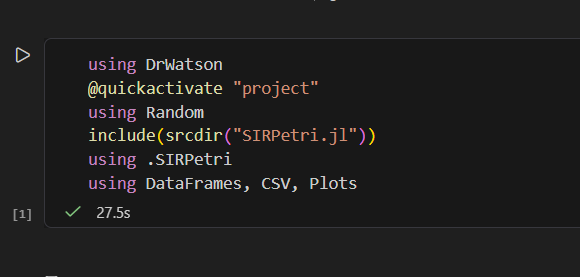

---
## Author
author:
  name: Селиванов Вячеслав Алексеевич
  degrees: DSc
  orcid: 0000-0002-0877-7063
  email: 1132236027@rudn.ru
  affiliation:
    - name: Российский университет дружбы народов
      country: Российская Федерация
      postal-code: 117198
      city: Москва
      address: ул. Миклухо-Маклая, д. 6
## Title
title: Презентация лабороторной работы №6
subtitle: Реализация основных моделей в подходе
сетей Петри
license: CC BY
date: today
date-format: "YYYY-MM-DD" # Example: 2025-09-06
---

# Информация

## Докладчик

:::::::::::::: {.columns align=center}
::: {.column width="70%"}

  * Селиванов Вячеслав Алексеевич
  

:::
::: {.column width="30%"}

:::
::::::::::::::

# Вводная часть

## Актуальность

- Сеть Петри есть математический аппарат для моделирования дискретных систем. Сегодня является мощным и наглядным математическим аппаратом. Она
незаменима везде, где нужно описать параллельные, асинхронные и распределённые системы. В её основе лежат всего четыре элемента, а богатство поведения
возникает из их комбинации.
- Модель SIR моделирует поведение эпидемии, помогая применять меры для противодействия эпидемии.

## Объект и предмет исследования

- Модель SIR в подходе сетей Петри

## Цели и задачи

Цель: Рассмотреть модель SIR в подходе сетей Петри
Задачи: Создать код модели, выполнить и визуализировать базовый эксперимент, проанализировать влияние параметра бета на модель, анимировать изменение количества человек в каждой группе,
 создать финальный отчёт, сравнить детерминированный и стохастический подход.

# Создание презентации

##

Инициализируем проект.

##

Добавим в проект необходимые пакеты.

##

Создадим файл с кодом модели.

## 

Прогоним базовый эксперимент.

## 

Проанализируем влияние коэффициента бета.

##

Анимируем изменение количества человек в группах S I R.

##

Визуализируем итоговый отчёт.

##

Создадим производные форматы.

##

Проверим работоспособность файлов Jupyter Notebook.

##

Чувствительность модели к бета.

## Выводы

В ходе данной лабораторной работы я познакомился и поработал с моделью SIR в подходе сетей Петри.
