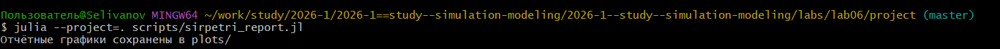
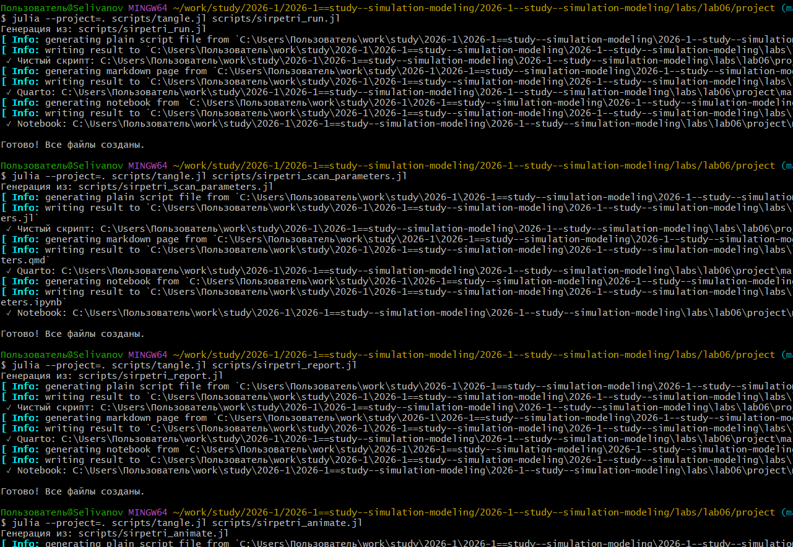

---
## Author
author:
  name: Селиванов Вячеслав Алексеевич
  degrees: DSc
  orcid: 0000-0002-0877-7063
  email: 1132236027@rudn.ru
  affiliation:
    - name: Российский университет дружбы народов
      country: Российская Федерация
      postal-code: 117198
      city: Москва
      address: ул. Миклухо-Маклая, д. 6

## Title
title: "Отчёт по лабороторной работе №6"
subtitle: "Реализация основных моделей в подходе
сетей Петри"
license: "CC BY"
---

# Цель работы

Рассмотреть модель SIR в подходе сетей Петри

# Задание

Создать код модели, выполнить и визуализировать базовый эксперимент, проанализировать влияние параметра бета на модель, анимировать изменение количества человек в каждой группе,
 создать финальный отчёт, сравнить детерминированный и стохастический подход.

# Теоретическое введение

Модель SIR делит всю популяцию на три взаимосвязанные группы (компартменты), что отражено в её названии:
— 𝑆 — Susceptible (Восприимчивые): люди, которые не болели, не имеют иммунитета и могут заразиться.
— 𝐼 — Infectious (Инфицированные/Заразные): люди, которые в данный момент
больны и могут передавать инфекцию.
— 𝑅 — Recovered (Выздоровевшие/Удаленные): люди, которые переболели и приобрели иммунитет (или умерли). Они больше не участвуют в передаче

Основная цель модели: не предсказать судьбу конкретного человека, а понять
общую динамику эпидемии — будет ли она разрастаться, как быстро, сколько
людей в итоге переболеет, как влияют карантинные меры

# Выполнение лабораторной работы

Инициализируем проект ([рис. @fig-001]).

{#fig-001 width=70%}

Добавим в проект необходимые пакеты ([рис. @fig-002]).

{#fig-002 width=70%}

Создадим файл с кодом модели ([рис. @fig-003]).

{#fig-003 width=70%}

Прогоним базовый эксперимент ([рис. @fig-004]).

{#fig-004 width=70%}

Проанализируем влияние коэффициента бета ([рис. @fig-005]).

{#fig-005 width=70%}

Анимируем изменение количества человек в группах S I R ([рис. @fig-006]).

{#fig-006 width=70%}

Визуализируем итоговый отчёт ([рис. @fig-007]).

{#fig-007 width=70%}

Создадим производные форматы ([рис. @fig-008]).

{#fig-008 width=70%}

Проверим работоспособность файлов Jupyter Notebook ([рис. @fig-009]).

{#fig-009 width=70%}






# Выводы

В ходе данной лабораторной работы я познакомился и поработал с моделью SIR в подходе сетей Петри.

# Список литературы{.unnumbered}

::: {#refs}
:::
