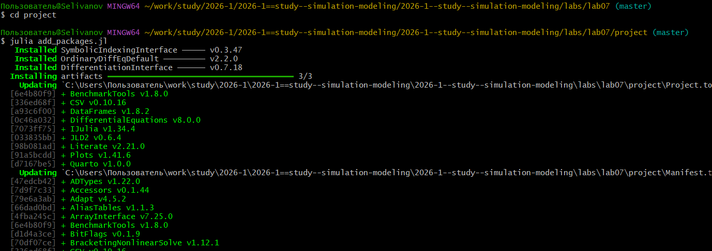
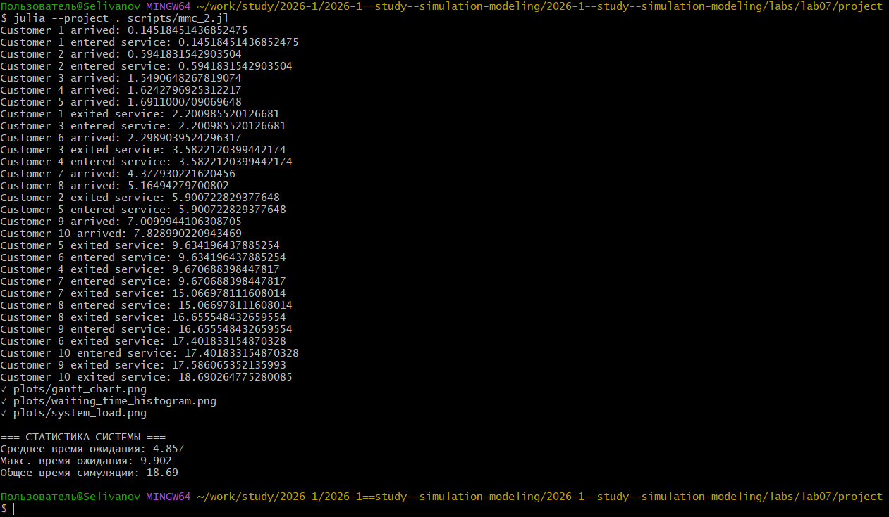
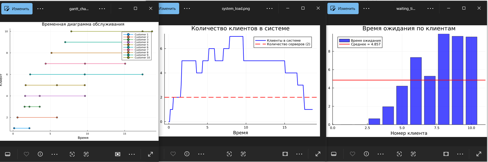
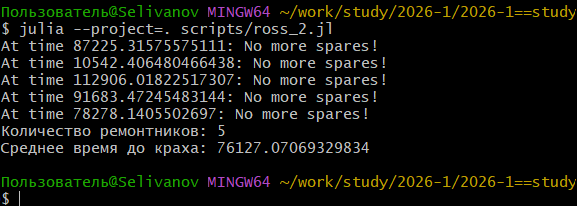
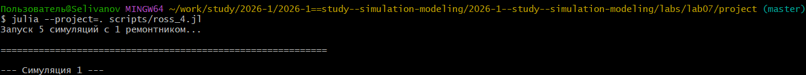
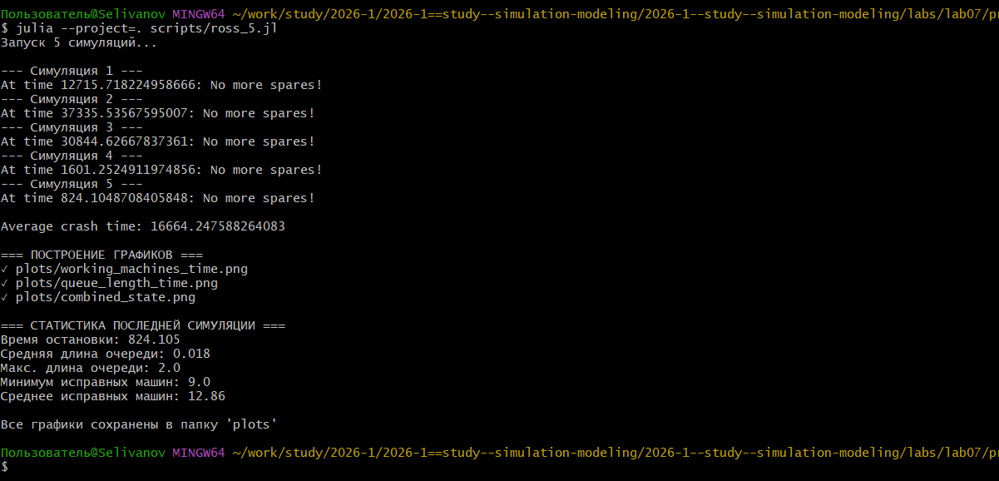
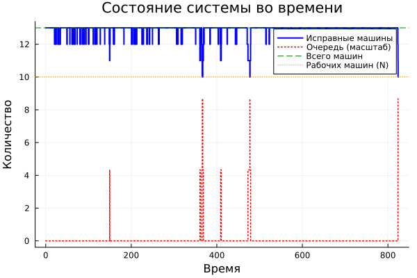

---
## Author
author:
  name: Селиванов Вячеслав Алексеевич
  degrees: DSc
  orcid: 0000-0002-0877-7063
  email: 1132236027@rudn.ru
  affiliation:
    - name: Российский университет дружбы народов
      country: Российская Федерация
      postal-code: 117198
      city: Москва
      address: ул. Миклухо-Маклая, д. 6
## Title
title: Презентация лабороторной работы №7
subtitle: Дискретно-событийное моделирование
license: CC BY
date: today
date-format: "YYYY-MM-DD" # Example: 2025-09-06
---

# Информация

## Докладчик

:::::::::::::: {.columns align=center}
::: {.column width="70%"}

  * Селиванов Вячеслав Алексеевич
  

:::
::: {.column width="30%"}

:::
::::::::::::::

# Вводная часть

## Актуальность

Модель M/M/c (по классификации Кендалла) — это система массового обслуживания со следующими свойствами:
— M (Markovian) — входящий поток заявок пуассоновский, интервалы между прибытиями распределены экспоненциально с параметром λ.
— M — время обслуживания каждой заявки распределено экспоненциально с
параметром μ.
— c — количество идентичных обслуживающих приборов (каналов), работающих
параллельно.

Модель Росса представляет собой классический пример системы массового обслуживания с конечной популяцией, резервом и ремонтом.
— В системе находятся 𝑁 идентичных машин, которые постоянно работают и
могут выходить из строя.
— 𝑆 машин находятся в резерве и готовы немедленно заменить любую отказавшую.
— Одно ремонтное устройство (ремонтник), которое может одновременно ремонтировать только одну машину.
— Когда работающая машина ломается, происходит следующее:
  — Немедленно берётся одна резервная машина (если она есть) и запускается
    в работу вместо сломавшейся.
  — Сломанная машина отправляется в ремонт.
  — Если резерва нет, система падает (crash). Моделирование заканчивается.
— После ремонта машина пополняет пул резервных (становится исправной и
ждёт).
— Требуется оценить среднее время до падения системы 𝐸[𝑇] при заданных
распределениях наработки до отказа и времени ремонта.

## Объект и предмет исследования

- Дискретно-событийное моделирование

## Цели и задачи

Цель: Рассмотреть Дискретно-событийное моделирование на примере двух моделей.
Задачи: Создать файлы с реализациями моделей, добавить графики и анализ влияния некоторых параметров.

# Создание презентации

##

Инициализируем проект.

##

Добавим в проект необходимые пакеты.

##

Реализуем модель M|M|c.

## 

Добавим графики.

## 

Проанализируем графики, полученные на предыдущем шаге.

##

Реализуем модель Росса с заданными параметрами.

##

Добавим в модель Росса несколько ремонтников.

##

Изменим число машин и резервных машин.

##

Проведем мониторинг загрузки ремонтника, средней длины очереди на ремонт.

##

Построим графики изменения числа исправных машин во времени.

##

Проанализируем графики.

##

Сгенерируем необходимые производные форматы.

##

Проверим работоспособность файлов .ipynb.

## Выводы

В ходе данной лабораторной работы я познакомился и поработал с Дискретно-событийным моделированием на примере двух моделей M|M|c и Росса.
