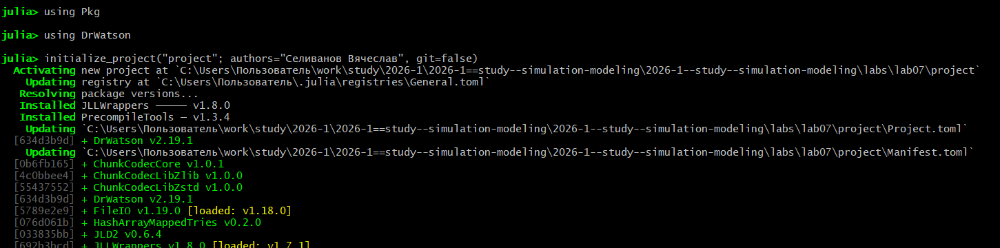
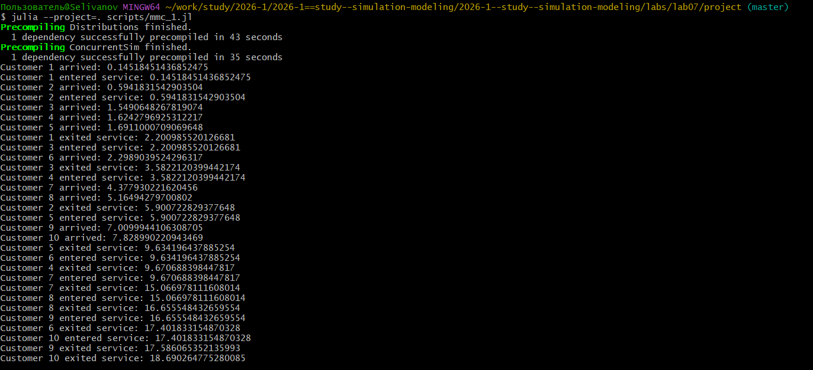
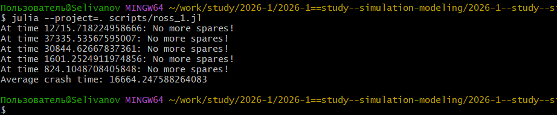
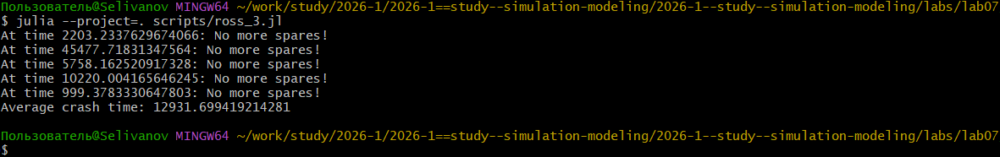
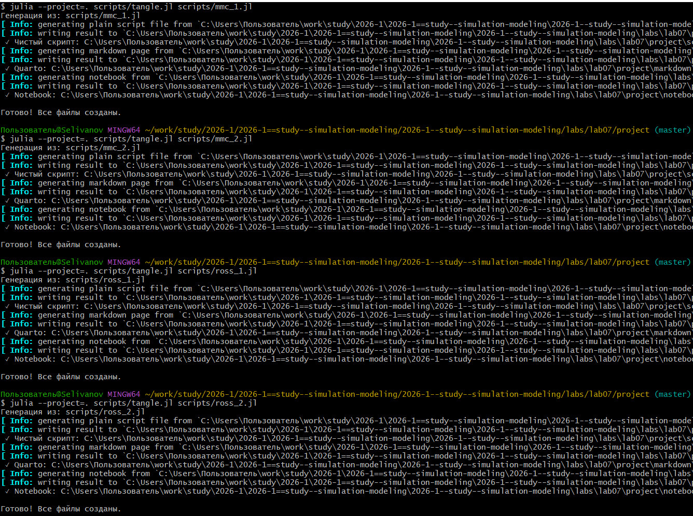
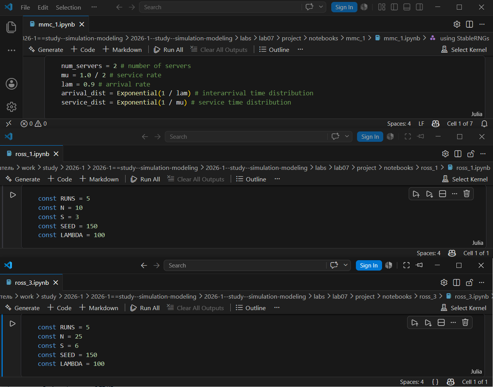

---
## Author
author:
  name: Селиванов Вячеслав Алексеевич
  degrees: DSc
  orcid: 0000-0002-0877-7063
  email: 1132236027@rudn.ru
  affiliation:
    - name: Российский университет дружбы народов
      country: Российская Федерация
      postal-code: 117198
      city: Москва
      address: ул. Миклухо-Маклая, д. 6

## Title
title: "Отчёт по лабороторной работе №7"
subtitle: "Дискретно-событийное моделирование"
license: "CC BY"
---

# Цель работы

Рассмотреть Дискретно-событийное моделирование на примере двух моделей.

# Задание

Создать файлы с реализациями моделей, добавить графики и анализ влияния некоторых параметров.

# Теоретическое введение

Модель M/M/c (по классификации Кендалла) — это система массового обслуживания со следующими свойствами:
— M (Markovian) — входящий поток заявок пуассоновский, интервалы между прибытиями распределены экспоненциально с параметром λ.
— M — время обслуживания каждой заявки распределено экспоненциально с
параметром μ.
— c — количество идентичных обслуживающих приборов (каналов), работающих
параллельно.

Модель Росса представляет собой классический пример системы массового обслуживания с конечной популяцией, резервом и ремонтом.
— В системе находятся 𝑁 идентичных машин, которые постоянно работают и
могут выходить из строя.
— 𝑆 машин находятся в резерве и готовы немедленно заменить любую отказавшую.
— Одно ремонтное устройство (ремонтник), которое может одновременно ремонтировать только одну машину.
— Когда работающая машина ломается, происходит следующее:
  — Немедленно берётся одна резервная машина (если она есть) и запускается
    в работу вместо сломавшейся.
  — Сломанная машина отправляется в ремонт.
  — Если резерва нет, система падает (crash). Моделирование заканчивается.
— После ремонта машина пополняет пул резервных (становится исправной и
ждёт).
— Требуется оценить среднее время до падения системы 𝐸[𝑇] при заданных
распределениях наработки до отказа и времени ремонта.

# Выполнение лабораторной работы

Инициализируем проект ([рис. @fig-001]).

{#fig-001 width=70%}

Добавим в проект необходимые пакеты ([рис. @fig-002]).

{#fig-002 width=70%}

Реализуем модель M|M|c ([рис. @fig-003]).

{#fig-003 width=70%}

Добавим графики ([рис. @fig-004]).

{#fig-004 width=70%}

Проанализируем графики, полученные на предыдущем шаге ([рис. @fig-005]).

{#fig-005 width=70%}

Реализуем модель Росса с заданными параметрами ([рис. @fig-006]).

{#fig-006 width=70%}

Добавим в модель Росса несколько ремонтников ([рис. @fig-007]).

{#fig-007 width=70%}

Изменим число машин и резервных машин ([рис. @fig-008]).

{#fig-008 width=70%}

Проведем мониторинг загрузки ремонтника, средней длины очереди на ремонт. ([рис. @fig-009]).

{#fig-009 width=70%}

Построим графики изменения числа исправных машин во времени. ([рис. @fig-010]).

{#fig-010 width=70%}

Проанализируем графики. ([рис. @fig-011]).

{#fig-011 width=70%}

Сгенерируем необходимые производные форматы. ([рис. @fig-012]).

{#fig-012 width=70%}

Проверим работоспособность файлов .ipynb. ([рис. @fig-013]).

{#fig-013 width=70%}









# Выводы

В ходе данной лабораторной работы я познакомился и поработал с Дискретно-событийным моделированием на примере двух моделей M|M|c и Росса.

# Список литературы{.unnumbered}

::: {#refs}
:::