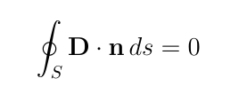
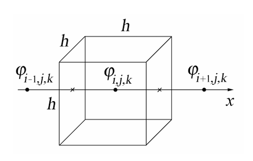
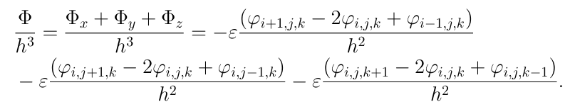

---
## Author
author:
  name: Софич А.Г,Солдатов С.А,Чистов Д.М,Соловьев Б.М,Селиванов В.А
  degrees: DSc
  orcid: 0000-0002-0877-7063
  email:
  affiliation:
    - name: Российский университет дружбы народов
      country: Российская Федерация
      postal-code: 117198
      city: Москва
      address: ул. Миклухо-Маклая, д. 6

## Title
title: "Электрический пробой"
subtitle: "Групповой проект"
license: "CC BY"
---

# Цели проекта

Изучить методы математического моделирования на примере электрического пробоя..

# Задачи проекта

Написать программу вычисления электрического потенциала итерационным методом.

Рассмотреть пробой в геометрии "острие– плоскость" с использованием флуктуационного критерия роста.

Рассмотреть пробой в геометрии "точка– окружность". Исследовать как меняется густота ветвей с радиусом стримерной структуры?

#  Определение

Возникновение искрового электрического разряда сильно зависит от условий эксперимента. 

- В длинных искровых промежутках (когда расстояние между электродами составляет десятки сантиметров или даже метры) при постепенном увеличении напряжения между электродами вначале наблюдается коронный разряд.

Коронный разряд наблюдается в виде синевато-фиолетового свечения на одном из электродов (катоде), охватывающего ту область электрода, где поле наиболее сильное, и затухающего по мере удаления от металлической поверхности. 

Корона возникает в основном в области неоднородного поля возле металлических выступов, "заусенцев", любых неоднородностей на электродах.

- При напряжениях, более высоких, чем те, которые приводят к образованию короны, в газах возникают так называемые стримеры.

Стримеры представляют собой систему слабосветящихся проводящих каналов, образующуюся в газе в области наиболее сильного электрического поля.

Стример прорастает, как правило, с одного из электродов и привысоких напряжениях может ветвиться.

Размер области, в которой развиваются стримеры, может составлять несколько метров даже в лабораторныхусловиях. Скорость продвижения стримера вглубь межэлектродного промежутка не меньше 10км/симожетдостигать 10000 км/с.

- В случае пробоя в газах при определенных условиях энерговыделения в стримерных каналах они превращаются в так называемые лидерные каналы.

Лидер это плазменное образование очень высокой светимости и настолько высокой проводимости, что его в некотором смысле можно считать продолжением электрода.

Скорость распространения лидера по порядку величины составляет 10 км/с. Перед головной частью лидера образуется стримерная корона, от которой зависит дальнейшая динамика лидерного канала.

# Основная часть

## Вычисление электрического потенциала

Рассмотрим простейший случай

Вещество однородно (диэлектрическая проницаемость среды ε везде одинакова), и первоначально в нем нет свободных зарядов.

По теореме Гаусса поток вектора индукции электрического поля D через любую замкнутую поверхность S равен нулю при отсутствии внутри поверхности свободных электрических зарядов,n– вектор внешней нормали к поверхности ([рис. @fig-001]).

{#fig-001 width=70%}

Рассмотрим в пространстве кубическую решетку с ячейками со сторонами h по всем координатам.

Сначала рассмотрим только один ряд ячеек вдоль оси x. Пусть электрический потенциал принимает в центре i-той ячейки значение $ϕ_{i,j,k}.$ Тогда проекция электрического поля на ось x на левой грани ячейки приближенно равна $$ E_{x}(x) ≈ −(ϕ_{i,j,k} − ϕ_{i−1,j,k})/h, $$ а на правой грани $$ E_x(x +∆x) ≈ −(ϕ_{i+1,j,k} − ϕ_{i,j,k})/h. $$

### Кубическая решетка ([рис. @fig-001]).

{#fig:002 width=30%}

 Вычисление электрического потенциала

Поток вектора индукции электрического поля изнутри ячейки через эти две грани равен

$$ Φ_x =εE_x(x+∆x)h^2 −εE_x(x)h^2 = −ε(ϕ_{i+1,j,k} −2ϕ_{i,j,k} + ϕ_{i−1,j,k})h. $$

Аналогично поток через нижнюю и верхнюю грани равен

$$ Φ_y =εE_y(y +∆y)h^2 −εE_y(y)h^2 = −ε(ϕ_{i,j+1,k} −2ϕ_{i,j,k} + ϕ_{i,j−1,k})h, $$

а через переднюю и заднюю грани 

$$ Φ_z =εE_z(z +∆z)h^2 −εE_z(z)h^2 = −ε(ϕ_{i,j,k+1} −2ϕ_{i,j,k} + ϕ_{i,j,k−1})h. $$

Складывая эти уравнения, вычислим полный поток изнутри ячейки и поделим его на объем ячейки ([рис. @fig-001]).

{#fig:003 width=50%}

### Уравнение Лапласа 

Каждая дробь представляет собой разностную аппроксимацию второй частной производной от потенциала по оответствующей координате. Так как в данном случае полный поток равен нулю, то при h → 0 уравнение для потенциала в однородном диэлектрике сводится к хорошо известному уравнению Лапласа:

$$ \frac{\partial^2 ϕ}{\partial x^2} + \frac{\partial^2 ϕ}{\partial y^2} - \frac{\partial^2 ϕ}{\partial z^2} = 0 $$

Используя условие равенства нулю полного потока из уравнения (2.1) можно также получить уравнение

$$ ϕ_{i−1,j,k} + ϕ_{i+1,j,k} + ϕ-{i,j−1,k} + ϕ-{i,j+1,k} + ϕ_{i,j,k−1} + ϕ_{i,j,k+1} − 6ϕ_{i,j} = 0. (2.2) $$

Вычисление электрического потенциала

Далее будем рассматривать плоский случай. Потенциал изменяется только в плоскости XY, поэтому по теореме Гаусса для квадратной ячейки сетки с номером i,j вместо формулы (2.2) получим

$$ ϕ_{i−1,j} + ϕ_{i+1,j} + ϕ_{i,j−1} + ϕ_{i,j+1} − 4ϕ_{i,j} = 0. $$

Последнее уравнение можно переписать в виде:

$$ ϕ_{i,j} = \frac{1}{4} (ϕ_{i−1,j} + ϕ_{i+1,j} + ϕ_{i,j−1} + ϕ_{i,j+1}). $$

Таким образом, если потенциал в каждом узле равен среднему арифметическому по соседним узлам, то эти значения как раз являются решением уравнений электростатики.

Систему уравнений (2.3) удобно решать методом итераций. "Новое" значение потенциала в каждом внутреннем узле вычисляется как среднее арифметическое "старых" значений потенциала в соседних с нимузлах по уравнению (2.3). Для того, чтобы начать итерации, необходимо задать для внутренних узлов расчетной области некие (вообще говоря, произвольные) начальные значения $ϕ_{i,j}$. При этом необходимые значения $ϕ_{i,j}$ на границе расчетной области берутся из граничных условий.

Доказано, что итерации всегда сходятся, т.е. значения потенциала стремятся к точному решению.

# Результаты

На данном этапе мы рассмотрели, что такое электрический пробой и что
он из себя представляет.
Так же мы познакомились с основными понятиями, которые используются при изучении и построении
уравнений и моделей электрического пробоя.

# Список литературы{.unnumbered}

- Моделирование физических процессов и явлений на ПК / Д. А. Медведев, А. Л. Куперштох, Э. Р. Прууэл [и др.]. – Новосибирск : Новосиб. гос. ун-т, 2010. – 101 с. – ISBN 978-5-94356-933-3.