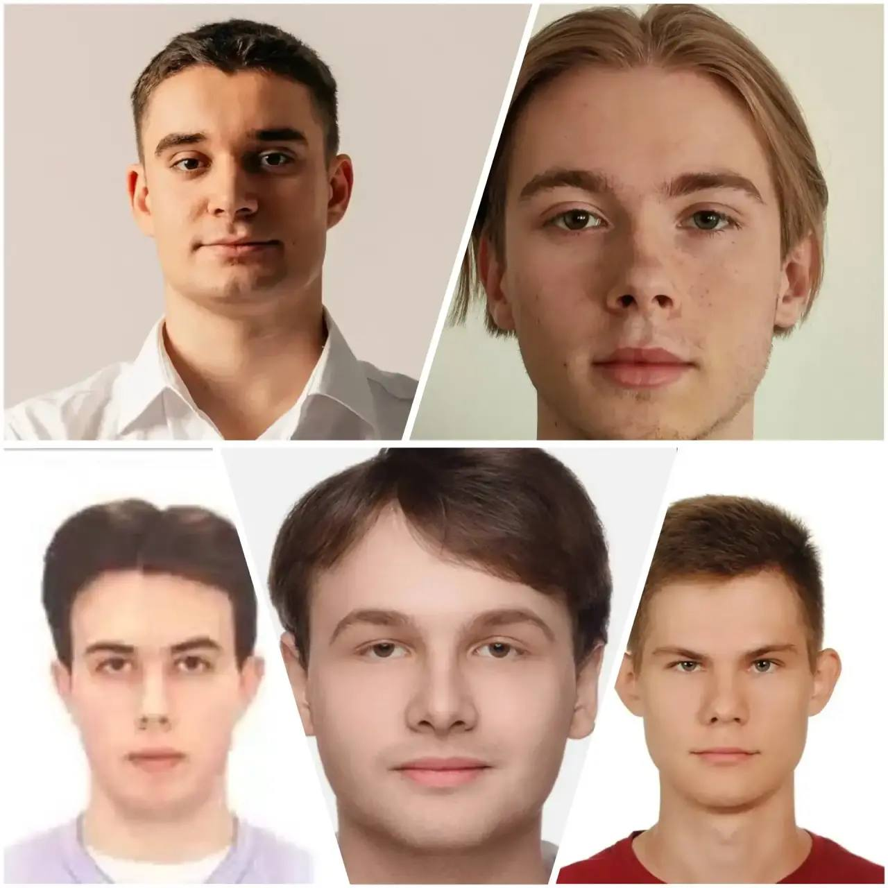

---
## Title
title: Электрический пробой
subtitle: Групповой проект
---

## Докладчики

:::::::::::::: {.columns align=center}
::: {.column width="50%"}

Селиванов Вячеслав Алексеевич
 
Солдатов Алексей Евгеньевич

Соловьев Богдан Михалыч

Софич Андрей Геннадьевич

Чистов Даниил Максимович

:::
::: {.column width="40%"}

:::
::::::::::::::

# Вводная часть

# Третий этап: Комплексы программ. Описание программной реализации проекта

## Структура программного комплекса

Для решения задач предложено разработать модульный комплекс, состоящий из трех независимых программных блоков, объединенных общим ядром:

-  **Модуль расчета электростатики** (решатель Лапласа)
-  **Модуль визуализации и анализа** (фрактальная размерность)
-  **Модуль генерации сценариев** (граничные условия и критерии роста)

**Общая архитектура:**
*   Итерационный цикл «Поле → Рост → Пересчет поля».
*   Хранение данных в виде целочисленных массивов (для меток: диэлектрик, электрод, стример).
*   Использование двойной точности (double) для расчета потенциала.

---

## 2. Модуль решения уравнения Лапласа

**Дискретизация области:**
- Квадратная сетка размером $N \times N$ (типично $N = 200 \dots 500$)
- Шаг сетки $h = 1$ в безразмерных единицах
- Потенциал хранится в массиве $\varphi[i][j]$ (тип double)

**Конечно-разностная аппроксимация:**
$$
\frac{\partial^2 \varphi}{\partial x^2} + \frac{\partial^2 \varphi}{\partial y^2} \approx \frac{\varphi_{i-1,j} - 2\varphi_{i,j} + \varphi_{i+1,j}}{h^2} + \frac{\varphi_{i,j-1} - 2\varphi_{i,j} + \varphi_{i,j+1}}{h^2} = 0
$$

**Итерационная формула (метод Якоби):**
$$
\varphi_{i,j}^{new} = \frac{\varphi_{i-1,j} + \varphi_{i+1,j} + \varphi_{i,j-1} + \varphi_{i,j+1}}{4}
$$

---

## 3. Методы ускорения сходимости

**Проблема:** Метод Якоби сходится медленно ($\sim N^2$ итераций)

**Решение 1 — метод Гаусса–Зейделя:**
- Использование обновленных значений "на лету"
- В 2 раза быстрее, чем Якоби

**Решение 2 — метод SOR (Successive Over-Relaxation):**
$$
\varphi_{i,j}^{new} = (1-\omega)\varphi_{i,j}^{old} + \frac{\omega}{4}(\varphi_{i-1,j}^{new} + \varphi_{i+1,j}^{old} + \varphi_{i,j-1}^{new} + \varphi_{i,j+1}^{old})
$$

**Оптимальный параметр релаксации:**
$$
\omega_{opt} = \frac{2}{1 + \sin(\pi / N)} \approx 1.9 \quad \text{для } N=200
$$

**Результат:** Ускорение сходимости в 10–20 раз

---

## 4. Модуль вероятностного роста стримера

**Ключевая идея:** Пробой — стохастический процесс из-за неоднородностей среды

**Флуктуационный критерий (Нимейер–Пьетронеро–Висман):**
Вероятность пробоя ячейки пропорциональна локальной напряженности поля в степени \(\eta\):
$$
P_k \propto E_k^{\eta}
$$

**Физический смысл параметра $\eta$:**

| \(\eta\) | Тип роста | Характеристики |
|:---:|:---:|:---|
| 0 | Случайный | Фрактал, изотропный |
| 1 | DLA-подобный | Диффузионно-ограниченный |
| 2 | Энергетический | Пропорционален $E^2$ (тепловыделение) |
| $\to \infty$ | Детерминированный | Прямой канал (минимальный путь) |

---

## 5. Алгоритм Монте-Карло для выбора ветви

**Пошаговый алгоритм выбора следующего узла:**

- **Поиск граничных узлов** — сканирование окрестности стримерной структуры
- **Вычисление локального поля** для каждого кандидата:
   $$
   E_k = \frac{\varphi_{стример} - \varphi_{кандидат}}{h}
   $$
- **Расчет весов** $W_k = E_k^{\eta}$
- **Вычисление суммы** $Z = \sum_{k=1}^{M} W_k$
- **Генерация случайного числа** $\xi = Z \cdot \text{random}$
- **Кумулятивный перебор:** найти $m$ такое, что $\sum_{k=1}^{m} W_k \ge \xi$
- **Присоединение** узла $m$ к стримеру

**Сложность:** $O(M)$ на шаг, где $M$ — число граничных узлов

---

## 6. Модуль граничных условий

**Типы граничных условий в программе:**

| Тип | Математическая формула | Физический смысл |
|:---|:---|:---|
| Дирихле (фиксированный) | $\varphi = const$ | Электрод, стенка |
| Неймана (адиабатический) | $\partial \varphi / \partial n = 0$ | Симметрия, изолятор |
| Периодические | $\varphi(0,y) = \varphi(L,y)$ | Бесконечная решетка |

**Реализация для геометрии "точка–окружность":**
- Окружность радиуса $R$ аппроксимируется ступенчатой линией
- Узлы внутри окружности — диэлектрик (начальное состояние)
- Узлы на окружности — потенциал $\varphi = 0$
- Узлы вне окружности — не рассматриваются (или Нейман)

---

## 7. Модуль фрактального анализа

**Цель:** Определить фрактальную размерность \(D_f\) стримерной структуры

**Метод 1 — зависимость массы от радиуса:**
$$
N(R) \sim R^{D_f}
$$
где $N(R)$ — число частиц в круге радиуса $R$

**Алгоритм:**
- Найти центр масс кластера
- Для каждого $R$ (логарифмическая шкала) подсчитать $N(R)$
- Построить график $\ln N$ vs $\ln R$
- Аппроксимировать прямой: $D_f = \text{tg}(\alpha)$

---

## 8. Метод подсчета ящиков (box-counting)

**Универсальный метод для любых фракталов:**

**Процедура:**
- Наложить на кластер сетку с ячейками размера $L$
- Подсчитать число непустых ячеек $N(L)$
- Уменьшить $L$ (обычно в 2 раза) и повторить
- Построить зависимость $\ln N(L) = -D_f \ln L + const$

**Преимущества:**
- Не требует знания центра кластера
- Работает для несвязных структур
- Хорошо усредняет анизотропию

## 9. Вычисление густоты ветвей

**Задача:** Исследовать, как меняется густота ветвей с радиусом стримерной структуры (геометрия "точка–окружность")

**Определение густоты:**
$$
\rho_{ветвей}(R) = \frac{\text{Число пересечений стримера с окружностью } R}{2\pi R}
$$

**Алгоритм:**
- Для каждого радиуса $R = 1, 2, \dots, R_{max}$
- Просканировать все узлы стримера с координатами $(x,y)$
- Если $\sqrt{x^2 + y^2} \approx R$ (с точностью до $h/2$), инкрементировать счетчик
- Нормировать на длину окружности $2\pi R$

**Ожидаемый результат:**
- При малых $R$ — густота высокая (ствол)
- При больших $R$ — густота падает или флуктуирует
- Зависимость от $\eta$: чем больше $\eta$, тем менее ветвистая структура

---

## Заключение

**В рамках третьего этапа разработан программный комплекс, включающий:**

- **Модуль расчета электростатики** — метод SOR с параметром релаксации $\omega \approx 1.9$
- **Модуль вероятностного роста** — флуктуационный критерий $P \propto E^{\eta}$
- **Модули визуализации и анализа** — графический вывод + фрактальная размерность
- **Модули граничных условий** — поддержка геометрий "острие–плоскость" и "точка–окружность"

